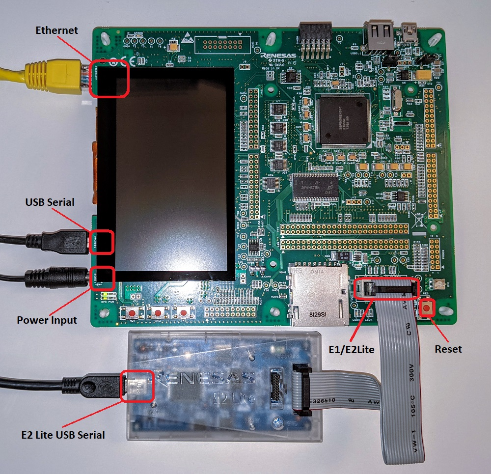
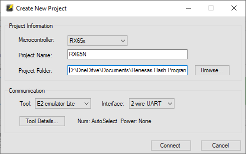
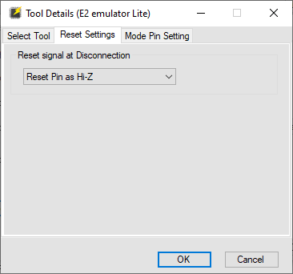
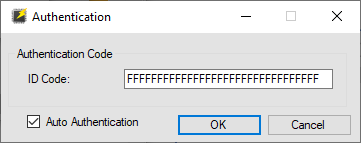
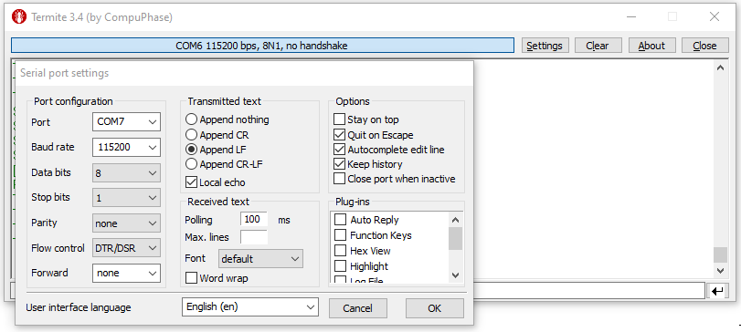
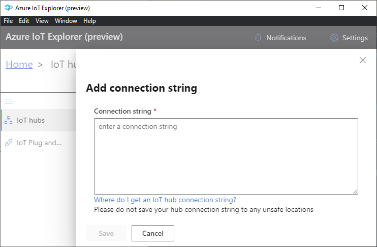
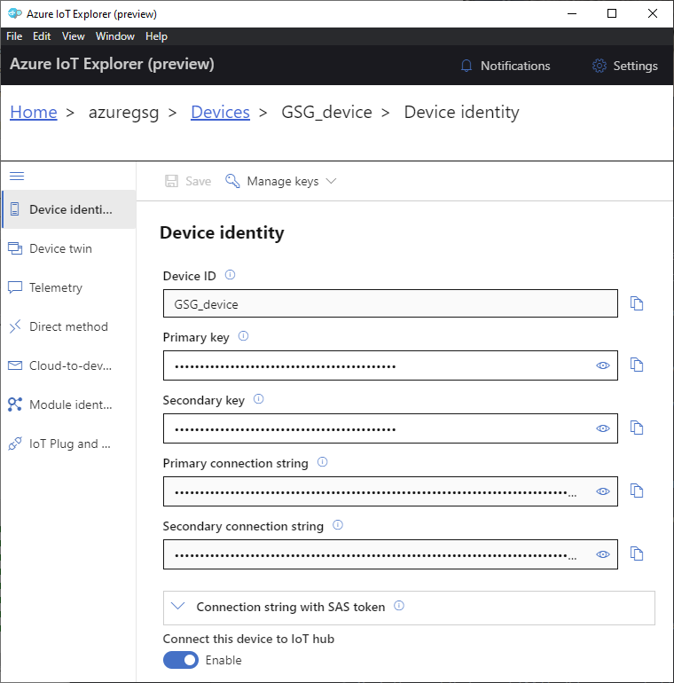
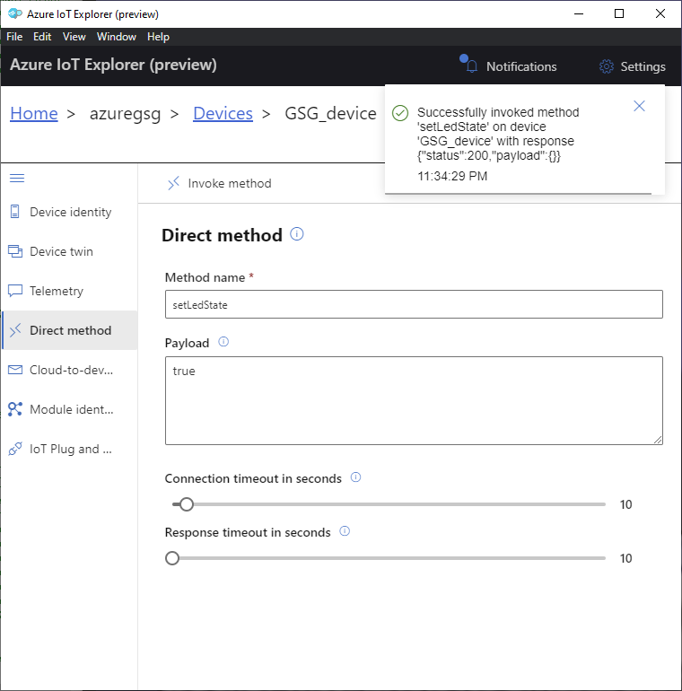

# Getting started with the Renensas Starter Kit+ for RX65N-2MB

**Total completion time**: 30 minutes

In this tutorial you use Azure RTOS to connect the Renensas Starter Kit+ for RX65N-2MB (hereafter, the Renesas RX65N) to Azure IoT.  The article is part of the series [Getting Started with Azure RTOS](https://go.microsoft.com/fwlink/p/?linkid=2129824). The series introduces device developers to Azure RTOS, and shows how to connect several device evaluation kits to Azure IoT.

You will complete the following tasks:

* Install a set of embedded development tools for programming the Renesas RX65N in C
* Build an image and flash it onto the Renesas RX65N
* Use Azure CLI to create and manage an Azure IoT hub that the Renesas RX65N will securely connect to
* Use Azure IoT Explorer to view properties, view device telemetry, and call cloud-to-device (c2d) methods

## Prerequisites

* A PC running Microsoft Windows 10
* If you don't have an Azure subscription, [create one for free](https://azure.microsoft.com/free/?WT.mc_id=A261C142F) before you begin.
* [Git](https://git-scm.com/downloads) for cloning the repository
* Hardware

    > * The [Renensas Starter Kit+ for RX65N-2MB](https://www.renesas.com/us/en/products/microcontrollers-microprocessors/rx-32-bit-performance-efficiency-mcus/rx65n-2mb-starter-kit-plus-renesas-starter-kit-rx65n-2mb) (Renesas RX65N)
    > * The [Renesas E2 emulator Lite](https://www.renesas.com/eu/en/software-tool/e2-emulator-lite-rte0t0002lkce00000r)
    > * 2 * USB 2.0 A male to Mini USB male cable
    > * The included 5V power supply
    > * Ethernet cable
    > * Wired Ethernet access

## Prepare the development environment

To set up your development environment, first you clone a GitHub repo that contains all the assets you need for the tutorial. Then you install a set of programming tools.

### Clone the repo for the tutorial

Clone the following repo to download all sample device code, setup scripts, and offline versions of the documentation. If you previously cloned this repo in another tutorial, you don't need to do it again.

To clone the repo, run the following command:

```shell
git clone --recursive https://github.com/azure-rtos/getting-started.git
```

### Install the tools

The cloned repo contains a setup script that installs and configures the required tools. If you installed these tools in another tutorial in the getting started guide, you don't need to do it again.

> Note: The setup script installs the following tools:

> * [GCC](http://gcc-renesas.com/downloads/get.php?f=rx/8.3.0.202004-gnurx/gcc-8.3.0.202004-GNURX-ELF.exe): Compile
> * [CMake](https://cmake.org): Build
> * [Termite](https://www.compuphase.com/software_termite.htm): Monitor serial port output for connected devices
> * [Azure CLI](https://docs.microsoft.com/en-us/cli/azure/): Manage Azure resources
> * [Azure IoT Explorer](https://github.com/Azure/azure-iot-explorer/releases): Cross-platform utility to  monitor and manage Azure IoT resources

To install the tools:

1. From File Explorer, navigate to the following path in the repo and run the setup script named *get-toolchain.bat*:

    > *getting-started\tools\get-toolchain-rx.bat*

    After the installation completes, the Azure IoT Explorer opens automatically. Keep the IoT Explorer open, you'll use it in later steps.

1. Add RX compiler to the Windows Path:

    > *%USERPROFILE%\AppData\Roaming\GCC for Renesas RX 8.3.0.202004-GNURX-ELF\rx-elf\rx-elf\bin*

1. After the installation, open a new console window to recognize the configuration changes made by the setup script. Use this console to complete the remaining programming tasks in the tutorial. You can use Windows CMD, PowerShell, or Git Bash for Windows.

1. Run the following commands to confirm that CMake version 3.14 or later is installed and the RX compiler path is setup correctly:

    ```shell
    cmake --version
    rx-elf-gcc
    ```

To install the remaining tools:

1. Install [Renesas Flash Programmer](https://www.renesas.com/software-tool/renesas-flash-programmer-programming-gui). The Renesas Flash Programmer contains the drivers and tools needed to flash the Renesas RX65N via the Renesas E2 Lite.

### Create an IoT hub

You can use Azure CLI to create an IoT hub that handles events and messaging for your device.

To create an IoT hub:

1. From your console window, run the [az group create](https://docs.microsoft.com/cli/azure/group?view=azure-cli-latest#az-group-create) command to create a resource group. The following command creates a resource group named *MyResourceGroup* in the *centralus* region.

    > Note: You can optionally set an alternate `location`. To see available locations, run [az account list-locations](https://docs.microsoft.com/cli/azure/account?view=azure-cli-latest#az-account-list-locations). For this tutorial we recommend using `centralus` as in the example CLI command. The IoT Plug and Play feature that you use later in the tutorial, is currently only available in three regions, including `centralus`.

    ```shell
    az group create --name MyResourceGroup --location centralus
    ```

1. Run the [az iot hub create](https://docs.microsoft.com/cli/azure/iot/hub?view=azure-cli-latest#az-iot-hub-create) command to create an IoT hub. It might take a few minutes to create an IoT hub.

    *YourIotHubName*. Replace this placeholder below with the name you chose for your IoT hub. An IoT hub name must be globally unique in Azure. This placeholder is used in the rest of this tutorial to represent your unique IoT hub name.

    ```shell
    az iot hub create --resource-group MyResourceGroup --name {YourIoTHubName}
    ```

1. After the IoT hub is created, view the JSON output in the console, and copy the `hostName` value to use in a later step. The `hostName` value looks like the following example:

    `{Your IoT hub name}.azure-devices.net`

### Register a device

In this section, you create a new device instance and register it with the IoT hub you created. You will use the connection information for the newly registered device to securely connect your physical device in a later section.

To register a device:

1. In your console, run the [az iot hub device-identity create](https://docs.microsoft.com/cli/azure/ext/azure-cli-iot-ext/iot/hub/device-identity?view=azure-cli-latest#ext-azure-cli-iot-ext-az-iot-hub-device-identity-create) command. This creates the simulated device identity.

    *YourIotHubName*. Replace this placeholder below with the name you chose for your IoT hub.

    *MyRenesasDevice*. You can use this name directly for the device in CLI commands in this tutorial. Optionally, use a different name.

    ```shell
    az iot hub device-identity create --device-id MyRenesasDevice --hub-name {YourIoTHubName}
    ```

1. After the device is created, view the JSON output in the console, and copy the `deviceId` and `primaryKey` values to use in a later step.

## Prepare the device

Confirm that you have the copied the following values from the JSON output from the previous sections:

> * `hostName`
> * `deviceId`
> * `primaryKey`

To connect the Renesas RX65N to Azure, you'll modify a configuration file for Azure IoT settings, rebuild the image, and flash the image to the device.

### Add configuration

1. Open the following file in a text editor:

    > *getting-started\Renesas\RSK_RX65N_2MB\app\azure_config.h*

1. Set the Azure IoT device information constants to the values that you saved after you created Azure resources.

    |Constant name|Value|
    |-------------|-----|
    |`IOT_HUB_HOSTNAME` |{*Your Iot hub hostName value*}|
    |`IOT_HUB_DEVICE_ID` |{*Your deviceID value*}|
    |`IOT_DEVICE_SAS_KEY` |{*Your primaryKey value*}|

1. Save and close the file.

### Connect the device

> Note: For more details about setting up and getting started with the Renesas RX65N, see [Renesas Starter Kit+ for RX65N-2MB Quick Start](https://www.renesas.com/document/man/e2studio-renesas-starter-kit-rx65n-2mb-quick-start-guide).

1. Complete the following steps using the following image as a reference.
    
    

1. Using the 5V power supply, connect the **Power Input** on the Rensas RX65N to an electrical outlet.

1. Using the Ethernet cable, connect the  **Ethernet** on the Renesas RX65N to your router.

1. Using the first Mini USB cable, connect the **USB Serial** on the Renesas RX65N to your computer.

1. Using the second Mini USB cable, connect the **E2 Lite USB Serial** on the Renesas E2 Lite to your computer.

1. Using the supplied ribbon cable, connect the **E1/E2Lite** on the Renesas RX65N to the Renesas E2 Lite.

### Build the image

In your console or in File Explorer, run the script *rebuild.bat* at the following path to build the image:

> *getting-started\Renesas\RSK_RX65N_2MB\tools\rebuild.bat*

After the build completes, confirm that a binary file was created in the following path:

> *getting-started\Renesas\RSK_RX65N_2MB\build\app\rx65n_azure_iot.hex*

### Flash the image

1. Launch the *Renesas Flash Programmer* application from the Start menu.

2. Select *New Project...* from the *File* menu, and enter the following settings:
    * **Microcontroller**: RX65x
    * **Project Name**: RX65N
    * **Tool**: E2 emulator Lite

    

3. Select the *Tool Details* button, and navigate to the *Reset Settings* tab.

4. Select *Reset Pin as Hi-Z* and press the *OK* button.

    

5. Press the *Connect* button and when prompted, check the *Auto Authentication* checkbox and then press *OK*.

    

6. Select the *Browse...* button and locate the *rx65n_azure_iot.hex* file created in the previous section.

7. Press *Start* to begin flashing. This process will take approximately 10 seconds.

### Confirm device connection details

You can use the **Termite** utility to monitor communication and confirm that your device is set up correctly.
> Note: If you have issues getting your device to initialize or connect after flashing, see [Troubleshooting](../../docs/troubleshooting.md).

1. Start **Termite**.
1. Select **Settings**.
1. In the **Serial port settings** dialog, check the following settings and update if needed:
    * **Baud rate**: 115,200
    * **Port**: The port that your Renesas RX65N is connected to. If there are multiple port options in the dropdown, you can find the correct port to use. Open Windows **Device Manager**, and view **Ports** to identify which port to use.
    * **Flow control**: DTR/DSR

    
1. Select OK.
1. Press the **Reset** button on the device.
1. In the **Termite** console, check the following checkpoint values to confirm that the device is initialized and connected to Azure IoT.

    ```output
    Starting Azure thread

    Initializing WiFi
    	Connecting to SSID 'iot'
    SUCCESS: WiFi connected to iot

    Initializing DHCP
    	IP address: 10.0.0.123
    	Mask: 255.255.255.0
    	Gateway: 10.0.0.1
    SUCCESS: DHCP initialized

    Initializing DNS client
    	DNS address: 10.0.0.1
    SUCCESS: DNS client initialized

    Initializing SNTP client
    	SNTP server 0.pool.ntp.org
    	SNTP IP address: 185.242.56.3
    	SNTP time update: Nov 16, 2020 23:47:35.385 UTC 
    SUCCESS: SNTP initialized

    Initializing Azure IoT DPS client
    	DPS endpoint: global.azure-devices-provisioning.net
    	DPS ID scope: ***
    	Registration ID: ***
    SUCCESS: Azure IoT DPS client initialized

    Initializing Azure IoT Hub client
    	Hub hostname: ***
    	Device id: ***
    	Model id: dtmi:azurertos:devkit:gsg;1
    Connected to IoTHub
    SUCCESS: Azure IoT Hub client initialized

    Starting Main loop
    ```

Keep Termite open to monitor device output in the following steps.

## View device properties

> **Note**: From this point in the tutorial, you can continue these steps, or you can optionally follow the same steps using the IoT Plug and Play preview. IoT Plug and Play provides a standard device model that lets a compatible device advertise its capabilities to an application. This approach simplifies the process of adding, configuring, and interacting with devices. To try IoT Plug and Play with your device, see [Using IoT Plug and Play with Azure RTOS](../../docs/plugandplay.md).

You can use the Azure IoT Explorer to view and manage the properties of your devices. In the following steps, you'll add a connection to your IoT hub in IoT Explorer. With the connection, you can view properties for devices associated with the IoT hub. Optionally, you can perform the same task using Azure CLI.

To add a connection to your IoT hub:

1. In your console window, run the [az iot hub show-connection-string](https://docs.microsoft.com/en-us/cli/azure/iot/hub?view=azure-cli-latest#az-iot-hub-show-connection-string) command to get the connection string for your IoT hub.

    ```shell
    az iot hub show-connection-string --name {YourIoTHubName}
    ```

1. Copy the connection string without the surrounding quotation characters.
1. In Azure IoT Explorer, select **IoT hubs > Add connection**.
1. Paste the connection string into the **Connection string** box.
1. Select **Save**.

    

If the connection succeeds, the Azure IoT Explorer switches to a **Devices** view and lists your device.

To view device properties using Azure IoT Explorer:

1. Select the link for your device identity. IoT Explorer displays details for the device.

    

1. Inspect the properties for your device in the **Device identity** panel.
1. Optionally, select the **Device twin** panel and inspect additional device properties.

To use Azure CLI to view device properties:

1. Run the [az iot hub device-identity show](https://docs.microsoft.com/en-us/cli/azure/ext/azure-iot/iot/hub/device-identity?view=azure-cli-latest#ext-azure-iot-az-iot-hub-device-identity-show) command.

    ```shell
    az iot hub device-identity show --device-id MyRenesasDevice --hub-name {YourIoTHubName}
    ```

1. Inspect the properties for your device in the console output.

## View telemetry

With Azure IoT Explorer, you can view the flow of telemetry from your device to the cloud. Optionally, you can perform the same task using Azure CLI.

To view telemetry in Azure IoT Explorer:

1. In IoT Explorer select **Telemetry**. Confirm that **Use built-in event hub** is set to *Yes*.
1. Select **Start**.
1. View the telemetry as the device sends messages to the cloud. 

    

    Note: You can also monitor telemetry from the device by using the Termite terminal.

1. Select **Stop** to end receiving events.

To use Azure CLI to view device telemetry:

1. In your CLI console, run the [az iot hub monitor-events](https://docs.microsoft.com/en-us/cli/azure/ext/azure-iot/iot/hub?view=azure-cli-latest#ext-azure-iot-az-iot-hub-monitor-events) command. Use the names that you created previously in Azure IoT for your device and IoT hub.

    ```shell
    az iot hub monitor-events --device-id MyRenesasDevice --hub-name {YourIoTHubName}
    ```

1. View the JSON output in the console.

    ```json
    {
        "event": {
            "origin": "MyRenesasDevice",
            "payload": "{\"temperature\": 28.5}"
        }
    }
    ```

1. Select CTRL+C to end monitoring.

## Call a direct method on the device

You can also use Azure IoT Explorer to call a direct method that you have implemented on your device. Direct methods have a name, and can optionally have a JSON payload, configurable connection, and method timeout. In this section, you call a method that enables you to turn an LED on or off. Optionally, you can perform the same task using Azure CLI.

To call a method in Azure IoT Explorer:

1. Select **Direct method**.
1. In the **Direct method** panel add the following values for the method name and payload. The payload value *true* indicates to turn the LED on.
    * **Method name**: `setLedState`
    * **Payload**: `true`
1. Select **Invoke method**. The LED light should turn on.

    
1. Change **Payload** to *false*, and again select **Invoke method**. The LED light should turn off.
1. Optionally, you can view the output in Termite to monitor the status of the methods.

To use Azure CLI to call a method:

1. Run the [az iot hub invoke-device-method](https://docs.microsoft.com/en-us/cli/azure/ext/azure-iot/iot/hub?view=azure-cli-latest#ext-azure-iot-az-iot-hub-invoke-device-method) command, and specify the method name and payload. For this method, setting `method-payload` to `true` turns the LED on, and setting it to `false` turns it off.

    <!-- Inline code tag and CSS to wrap long code lines. -->
    <code style="white-space : pre-wrap !important;">
    az iot hub invoke-device-method --device-id MyRenesasDevice --method-name setLedState --method-payload true --hub-name {YourIoTHubName}
    </code>

    The CLI console shows the status of your method call on the device, where `204` indicates success.

    ```json
    {
      "payload": {},
      "status": 204
    }
    ```

1. Check your device to confirm the LED state.

1. View the Termite terminal to confirm the output messages:

    ```output
    Received direct method=setLedState, id=1, message=true
    LED is turned ON
    Sending device twin update with bool value
    Sending message {"ledState":true}
    Direct method=setLedState invoked
    ```

## Clean up resources

If you no longer need the Azure resources created in this tutorial, you can use the Azure CLI to delete the resource group and all the resources you created for this tutorial. Optionally, you can use Azure IoT Explorer to delete individual resources including devices and IoT hubs.

If you continue to another tutorial in this Getting Started guide, you can keep the resources you've already created and reuse them.

> **Important**: Deleting a resource group is irreversible. The resource group and all the resources contained in it are permanently deleted. Make sure that you do not accidentally delete the wrong resource group or resources.

To delete a resource group by name:

1. Run the [az group delete](https://docs.microsoft.com/cli/azure/group?view=azure-cli-latest#az-group-delete) command. This removes the resource group, the IoT Hub, and the device registration you created.

    ```shell
    az group delete --name MyResourceGroup
    ```

1. Run the [az group list](https://docs.microsoft.com/cli/azure/group?view=azure-cli-latest#az-group-list) command to confirm the resource group is deleted.  

    ```shell
    az group list
    ```

## Next Steps

In this tutorial you built a custom image that contains Azure RTOS sample code, and then flashed the image to the Renesas RX65N device. You also used the Azure CLI to create Azure resources, connect the Renesas RX65N securely to Azure, view telemetry, and send messages.

* For device developers, the suggested next step is to see the other tutorials in the series [Getting started with Azure RTOS](https://go.microsoft.com/fwlink/p/?linkid=2129824).
* If you have issues getting your device to initialize or connect after following the steps in this guide, see [Troubleshooting](../../docs/troubleshooting.md).
* To learn more about how Azure RTOS components are used in the sample code for this tutorial, see [Using Azure RTOS in the Getting Started Guides](../../docs/using-azure-rtos.md).
    >Note: Azure RTOS provides OEMs with components to secure communication and to create code and data isolation using underlying MCU/MPU hardware protection mechanisms. However, each OEM is ultimately responsible for ensuring that their device meets evolving security requirements.
